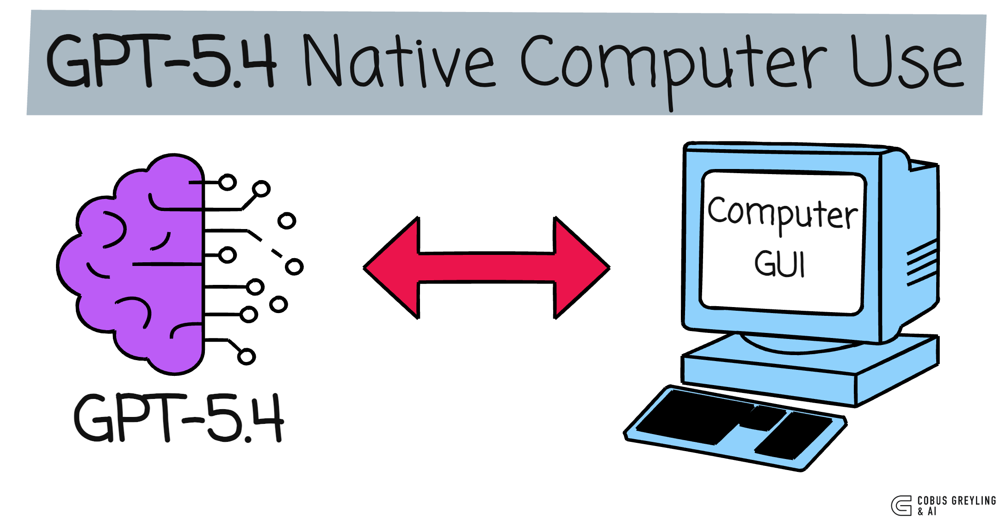
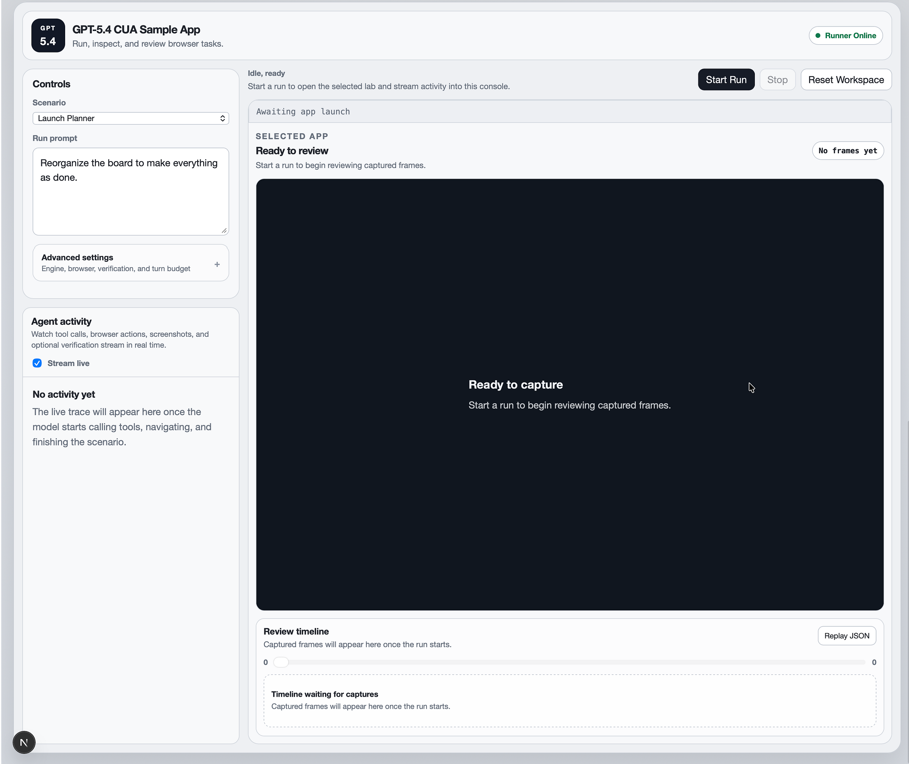
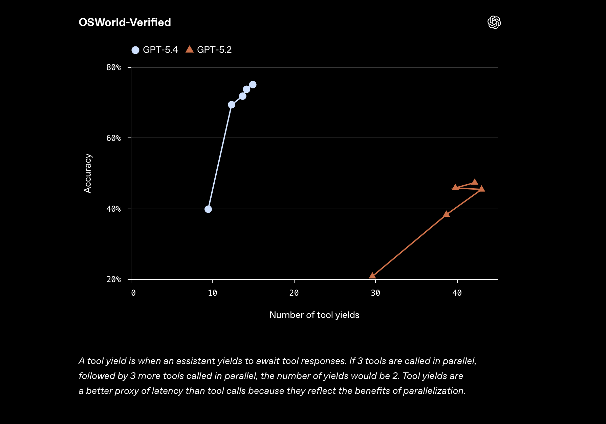
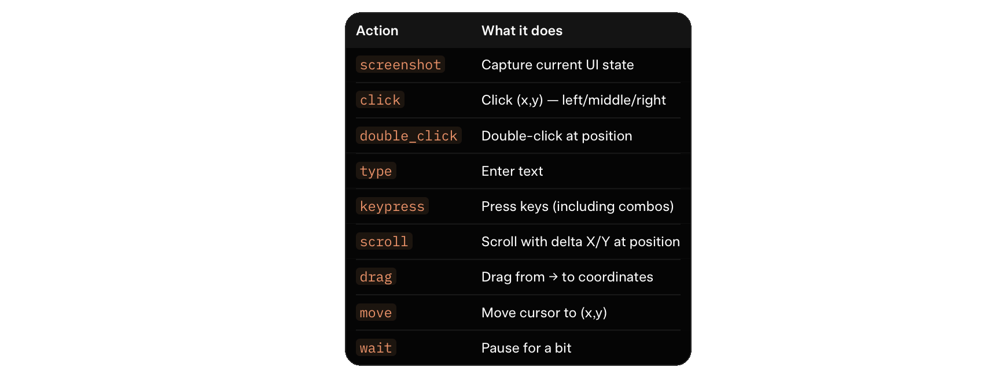
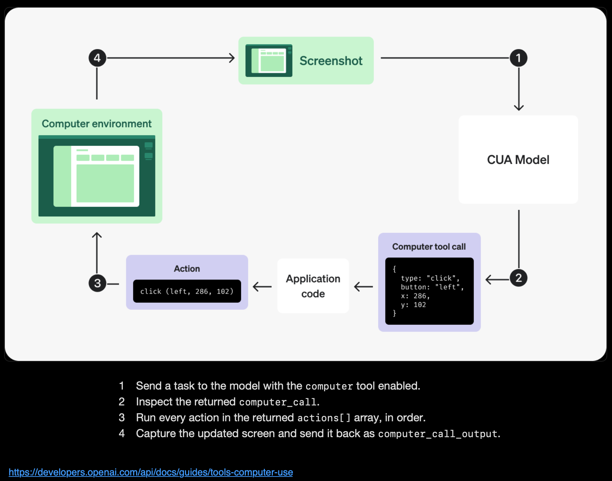
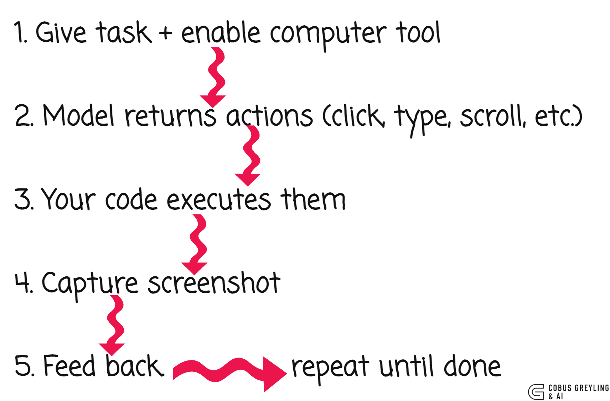
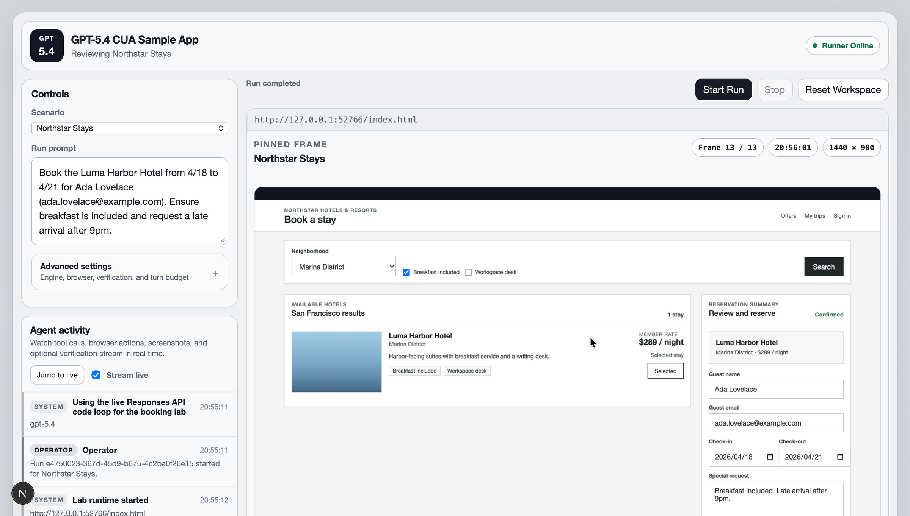

# GPT-5.4 Native Computer Use

**The first general-purpose model that truly operates your computer.**



Elon Musk nailed it in a recent interview…

Before we crack full physical AI autonomy, we first need to master digital AI autonomy.

That means AI using a computer the way a human does.

Navigating UIs, clicking, typing, scrolling. Fully autonomous.

Anthropic has a heavy focus on computer use. With Claude Code for terminal operation.



https://github.com/openai/openai-cua-sample-app

The recent Vercept acquisition for desktop-level control. Companies are racing to solve for this capability.

I've written extensively about AI Agents via CLI (still crucial for deep system integration, especially Unix-like environments), but GUI/screen navigation has always been the missing piece for broad, real-world agency.

When OpenAI first shipped Operator along with the initial Computer-Using Agent (CUA), I covered it.

The concept was compelling. A model that could see and act on screens. But execution felt early, to be honest.

Hosted browser sessions, noticeable latency, modest real-world success rates.

The pixel-to-action paradigm is what makes native computer use feel truly agentic.

The interface becomes the universal API, powered by vision understanding rather than brittle selectors or per-app integrations.

## GPT-5.4 changes this

Computer use is no longer bolted-on or wrapped in a hosted service.

It's native. Baked directly into the model.

You feed it a screenshot (or let it request one), it returns structured actions.

No intermediaries. Just a clean computer tool in the API.

The benchmark leap grabbed my attention.

GPT-5.4 with multi-step workflows. GPT-5.4 now outperforms humans on key tests…



https://openai.com/index/introducing-gpt-5-4/

## The Interface is the API

No more bespoke connectors for every app…

Describe the goal in natural language, point the model at the screen, and it figures out the clicks, types, scrolls.

GPT-5.4 covers the full human input set, as seen below…

## Action Vocabulary



A vision-language model that reads GUIs natively.

Buttons, menus, forms, dialogs.

The same way we do.

With a 1M token context window, long multi-screen workflows become practical in one session.

## What native computer use opens up



Old automation needed per-app APIs, extensions, or brittle scripts. GPT-5.4 flips it.

Screenshot to reasoning to actions.

The same model that codes, reasons, and chats can now drive your desktop.

The loop is clean:



No DOM scraping. No accessibility trees. No brittle selectors. Just pixels and primitives.

## API in action

Enable it like this (Python example):

```python
from openai import OpenAI

client = OpenAI()

response = client.responses.create(
    model="gpt-5.4",
    tools=[{"type": "computer"}],
    input="Open browser and search for 'NVIDIA Nemotron'"
)
```

The model returns structured actions:

```json
{
    "type": "computer_call",
    "call_id": "call_abc123",
    "actions": [
        {"type": "screenshot"},
        {"type": "click", "button": "left", "x": 405, "y": 157},
        {"type": "type", "text": "NVIDIA Nemotron"}
    ]
}
```

Execute the actions, take a screenshot (base64), send it back with `detail: "original"` for full-res accuracy.

## OpenAI's CUA Sample App

The CUA sample app is a solid reference implementation.



https://github.com/openai/openai-cua-sample-app

A TypeScript monorepo showing browser-focused CUA…

Run it locally:

```bash
git clone <repo-url>
cd openai-cua-sample-app
corepack enable
pnpm install
cp .env.example .env
```

Great starting point for your own harness.

## Three Ways to Build

**1. Native computer tool** — Screenshot + coordinate actions. Ideal for general desktop/browser automation

**2. Code execution** — Give a persistent Playwright/Python REPL. Model scripts for hybrid visual + programmatic control

**3. Custom tool wrappers** — Wrap Playwright/Selenium as callable tools

Native wins for zero-per-app integration. Code mode wins for repetitive precision.

## The Base64 Screenshot Loop

The base64 screenshot approach is the core mechanism feeding visual UI context to the model.

---

*Chief Evangelist @ Kore.ai | I'm passionate about exploring the intersection of AI and language. From Language Models, AI Agents to Agentic Applications, Development Frameworks & Data-Centric Productivity Tools, I share insights and ideas on how these technologies are shaping the future.*


---

### Sources

- [Introducing GPT-5.4 | OpenAI](https://openai.com/index/introducing-gpt-5-4/)
- [Computer use | OpenAI API](https://developers.openai.com/api/docs/guides/tools-computer-use)
- [OpenAI CUA Sample App | GitHub](https://github.com/openai/openai-cua-sample-app)
